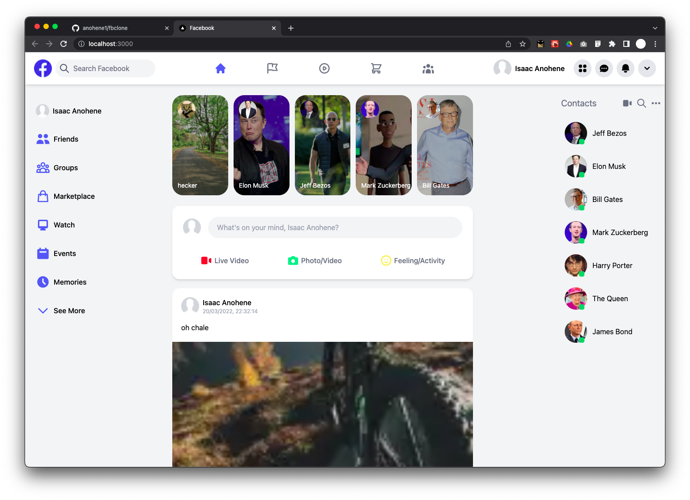
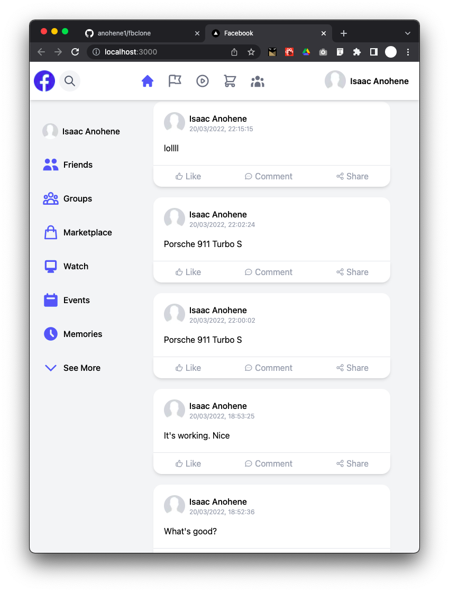
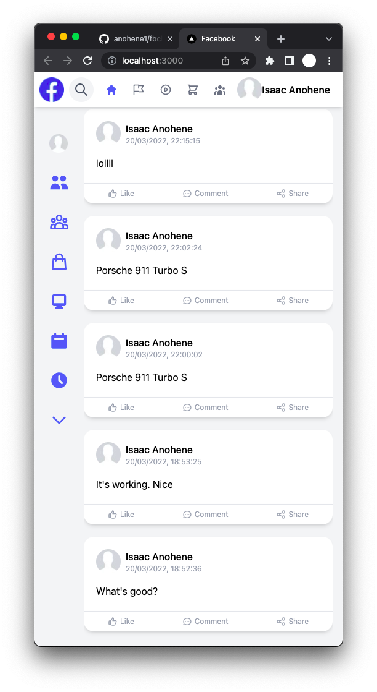

# FBClone
This is a Facebook clone built while learning NextJS.

- Uses TailwindCSS
- Uses Firebase Storage to store images
- Uses Firestore to store data
- Is responsive

##Screenshots
<table>
    <tr>
        <td colspan="2">
            
        </td>
    </tr>
    <tr>
        <td>
            
        </td>
<td>
            
        </td>
    </tr>
</table>